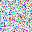

# Win_Konata_Dancer
Direct2D Edition

    
  

<table width="100%" cellpadding="0" cellspacing="0" style="border: none; position: relative;">
  <tr>
    <td style="vertical-align: top; padding: 0;">
      
      
      <h1>test</h1>
      
test

      
      <h2>da</h2>
      <ul><li>test</li></ul>
      
      <h2>test</h2>
      <ul><li>test</li></ul>
      
      <h2>test</h2>
      <ul>
        <li>da: <a href="#">@test</a></li>
        <li>da: <a href="#">test</a></li>
        <li>da: <a href="#">test.com</a></li>
      </ul>
    </td>
  </tr>
</table>

<table width="100%" cellpadding="0" cellspacing="0" style="border: none; margin: 0; padding: 0;">
  <tr>
    <td style="padding: 0; margin: 0;">
      
    </td>
  </tr>
</table>

  

